## Dev Ops and Deployments

When it comes to deploying containerized, modern, fullstack applications, all you really need is:
- a decent DNS provider
- a place to run a container
- a nice proxy around your container

For me, this means:

**Cloudflare**

[Cloudflare](https://www.cloudflare.com/) makes a host of very useful products, on top of running alot of the internet. For this though, we'll just be using their DNS zones in order to manage the DNS records of our apps.

I specifically love their DNS offerings and host all my records there if I can.
There might be a case to use them for more in these examples, such as hosting my static home page for 
 this project. I leave that up to reader to explore and suggest in a nicely worded email.

**Digital Ocean**

Any service provider that offers networked VMs with Linux should work fine for our use. I personally liked digital ocean for some reason last year, so I've stuck with it.

**Kamal**

So I should probably explain [Kamal](https://kamal-deploy.org/) and contextualize why I include it in my stack.

Until you get to the point where you're orchestrating multiple containers or handling a looooot of traffic, there's
not a real need to have a dedicated load balancer sitting outside your container. Moreover, relying on whatever cloud product of the provider (such as AWS ALB or something) your hosting on is annoying since:
- you will have to learn how to use it
- it more of less won't apply anywhere else

Traditionally, folks use Nginx for this sort of thing, or maybe even SWAG, which is like Nginx but provides
- a lot of really nice, sane defaults
- SSL setup through Let's Encrypt

Throw either of those together with a docker composition and you're pretty much off to the races hosting some simple services.

I've use both and eventually settled on Kamal, because it:
- handles local orchestration of containers
- SSL through Let's Encrypt
- deployments
- and environment management

all in one! Which is incredibly handle and much more succint than trying to wrangle a deployment out of a bunch of different tools. I should know, I used to do all of that myself [with a series of anisble playbooks](https://github.com/amiller68/krondor-hetzner-iac) I stitched together over the years.

**Terraform**

You could succeed at deploying this stack without [Terraform](https://terraform.io), since its simple enough to setup through providers respective web UIs:
- set up the Digital Ocean VM
- set up a Docker resgitry for your image
- Configure your domain with the correct IP address
- and Point kamal at your server, specifying your image

I just ended up doing this so many times I decided to orchestrate it all! Terraform is great for this, and Hashicorp also provides suite of other
